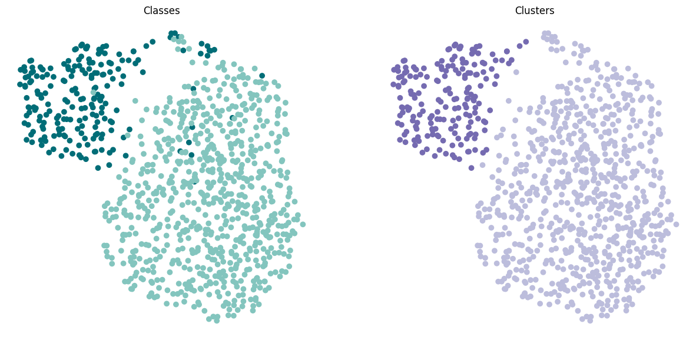

# Exemplary code for clustering of global glomerulosclerosis



## Abstract

The classification between globally sclerosed and non-globally sclerosed glomeruli represents one of the most basic distinctions among glomerular lesions. The current project illustrates that such a distinction can to a large extent be achieved via clustering with pretrained convolutional neural networks without the need for any fine-tuning or training on glomerular images.

## Code

Exemplary code is made available via a Jupyter Notebook, which runs stain normalization of glomerular images, extracts image features using a convolutional neural network, runs Leiden clustering, computes the adjusted Rand index between cluster and class labels, and plots the feature embedding and clustering results.

## Data

The code snippet is based on glomeruli extracted from a set of kidney whole slide images published by [Bueno et al. 2020](https://www.sciencedirect.com/science/article/pii/S2352340920302080), available and reused under a Creative Commons Attribution 4.0 International licence ([CC BY 4.0](https://creativecommons.org/licenses/by/4.0/)). The whole slide images were obtained from [here](https://data.mendeley.com/datasets/k7nvtgn2x6/3).

```         
@article{bueno2020data,
  title={Data for glomeruli characterization in histopathological images},
  author={Bueno, Gloria and Gonzalez-Lopez, Lucia and Garcia-Rojo, Marcial and Laurinavicius, Arvydas and Deniz, Oscar},
  journal={Data in brief},
  volume={29},
  pages={105314},
  year={2020},
  publisher={Elsevier}
}
```

## Citation

If you make use of the code in your research, please cite:

```
@article{weishaupt2025unsupervised,
 title={Unsupervised learning for labeling global glomerulosclerosis},
 author={Weishaupt, Hrafn and Besusparis, Justinas and Weis, Cleo-Aron and Porubsky, Stefan and Laurinavičius, Arvydas and Leh, Sabine},
 journal={Computers in Biology and Medicine}, 
 volume={196},
 year={2025},
 month={Sep},
 pages={110719}}
 DOI={10.1016/j.compbiomed.2025.110719}
```
# License

Shield: [](http://creativecommons.org/licenses/by-nc-sa/4.0/)

This work is licensed under a [Creative Commons Attribution-NonCommercial-ShareAlike 4.0 International License](http://creativecommons.org/licenses/by-nc-sa/4.0/).

[](http://creativecommons.org/licenses/by-nc-sa/4.0/)
